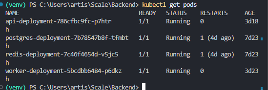
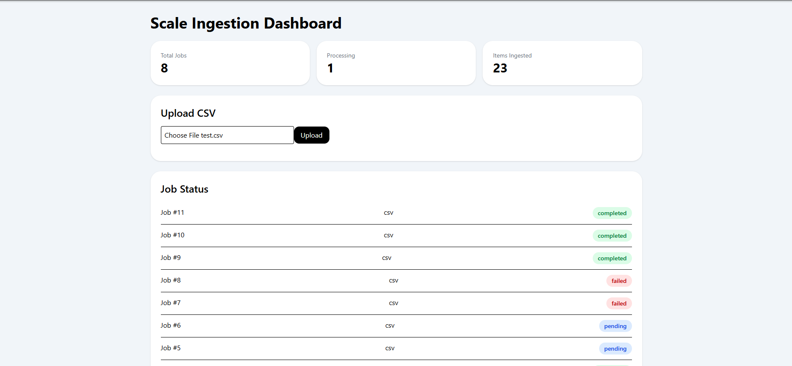
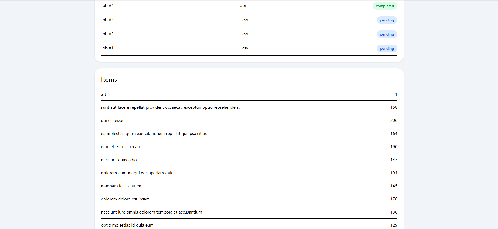

# 🚀 Scalable Data Ingestion System

A production-style ingestion platform built with FastAPI, Celery, Redis, PostgreSQL, Kubernetes, and React for asynchronous CSV processing and real-time job monitoring.

## 🧠 Overview

This project simulates a scalable ingestion architecture that accepts CSV uploads, processes them asynchronously through background workers, stores results in PostgreSQL, and displays ingestion activity through a live React dashboard.

Built using:

- FastAPI (API layer)
- Celery (background workers)
- Redis (message broker)
- PostgreSQL (data persistence)
- React + Vite (dashboard UI)
- Kubernetes (deployment/orchestration)
- PersistentVolumeClaims (shared storage)
- Docker (containerization)

## ⚙️ Architecture

React Dashboard
↓
Vite Proxy
↓
FastAPI API
↓
Redis Queue
↓
Celery Worker
↓
PostgreSQL

Shared Storage (PVC)
↙ ↘
API Pod Worker Pod

## 🔥 Features

- Asynchronous CSV/API ingestion
- Background processing with Celery workers
- Redis message broker
- PostgreSQL persistence
- Job tracking and status monitoring
- React dashboard
- Kubernetes deployment
- Shared storage using PersistentVolumeClaims

## 🛠️ Tech Stack

Frontend:

- React
- Vite
- Axios
- TailwindCSS

Backend:

- FastAPI
- SQLAlchemy
- Celery
- Redis
- PostgreSQL
- Python

Infrastructure:

- Docker
- Kubernetes
- PersistentVolumeClaims

## 🚀 Getting Started

### 1. Clone the repo

```bash
git clone https://github.com/YOUR_USERNAME/scale-ingestion-system.git
cd scale-ingestion-system
```

### Backend

```bash
docker compose up --build
```

### Frontend

```bash
cd frontend

npm install

npm run dev
```

Dashboard:

```text
http://localhost:5173
```

API:

```text
http://localhost:8000/docs
```

---

## 🧩 Challenges Solved

- Solved cross-container file sharing issues by implementing Kubernetes PersistentVolumeClaims
- Debugged CORS and Vite proxy configuration between React and FastAPI
- Built asynchronous processing to keep API response times fast
- Added polling and status updates for real-time dashboard monitoring

---

## 📈 Future Improvements

- Authentication and role-based access
- Retry failed ingestion jobs
- Charts and ingestion analytics
- Observability using Prometheus/Grafana

## Screenshots




